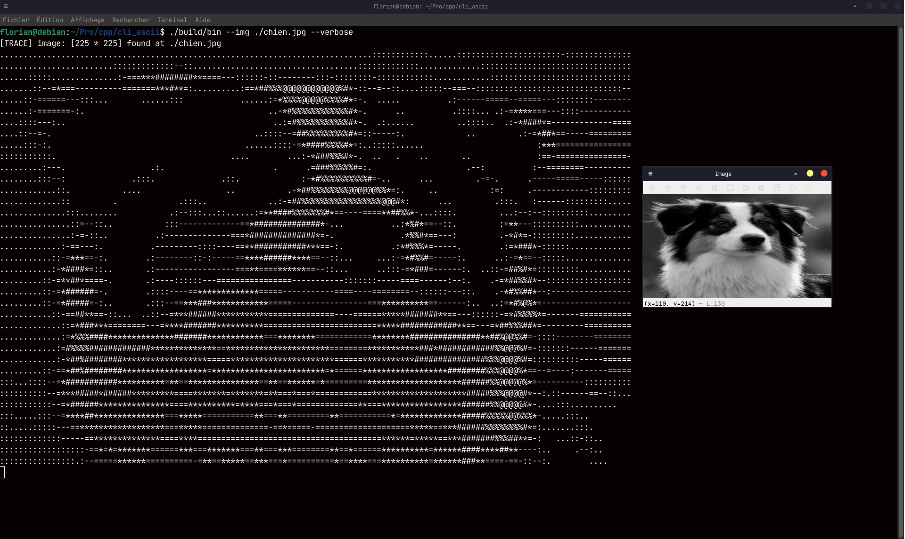

# ASCLII simply transform an image on your hard disk to an ascii variant in the console

## Important:
- *It is optimized for POSIX only for now*
- *It use Opencv librarie for now*

## Preview:


</br>

Compile it with:
```bash
# bash with make
make compile

# bash without make
g++ -Wall -Wextra -std=c++17 -I/*your_path_to*/opencv4  -o ./build/asclii main.cpp `pkg-config --cflags --libs opencv4`
```

</br>

Use it with --img flag and a valid path to an image:
```bash
# bash
./build/asclii --img ./image_path.(png, jpg)

# enable logging with --verbose flag
./build/asclii --img ./image_path.(png, jpg) --verbose

```

</br>

You have a built-in documentation with:
```bash
./build/asclii --help
```

</br>

## TODO:

- [ ] Improve/Refactor the code
- [ ] Make it cross plateform
- [ ] Add support for gif and video
- [ ] Get rid of opencv and implement my own images handler librarie
- ~~[ ] Rewrite it in Rust~~